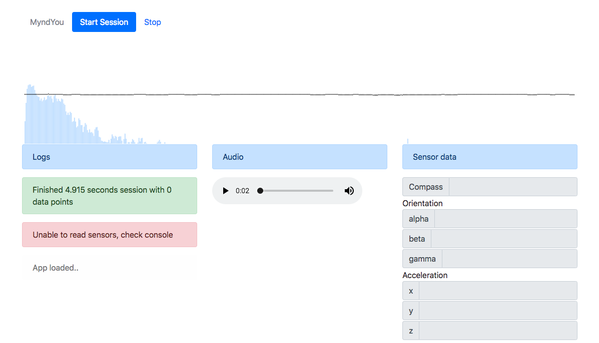

# Fullstack assesment assignment

Welcome and thank you for taking the time to interview with us!

Some of what we do at MyndYou is analyzing streams of data.

This project is a small example of what types of data we can capture on the web from a mobile device.

It is best to test the app from a mobile device, otherwise no sensor data will be captured.

Here are some challenges for you to complete before we move forward, good luck 😎

### Before you begin
1. The assignemnet should be completed and pushed to a forked version of this repository.
1. Feel free to reach out if you encounter any problems or have questions - good communication is a big part of the role.
1. Use NodeJS for server side with any database (if needed)
1. Use ReactJS or VueJS for client side
1. It is best to limit the time you invest in the task, 2-3 hours should be enough. It's fine if not all the tasks get completed.
1. The are multiple ways to run that app on a mobile device - you can deploy to a server, use ngrok to map your localhost to an address etc. Pick whatver suits you.

### The assignemnt
1. Once a session is completed a WAV file is downloded containing the recording. Upload the WAV file to a server instead of it being downloaded.
1. Create a webpage to display a list of all the uploaded recordings along with the recording time, creation date and an option to play it.
1. Currently the app downloads multiple CSVs with data. Instead, use SocketIO to stream the data contniously the moment a recording starts. The streamed data should be `console.log`'d on the server.
